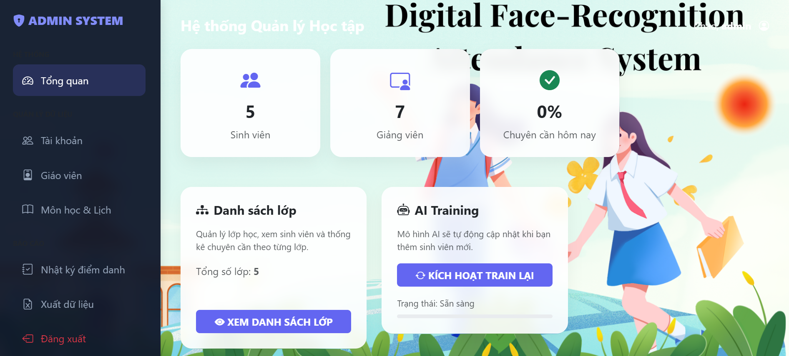
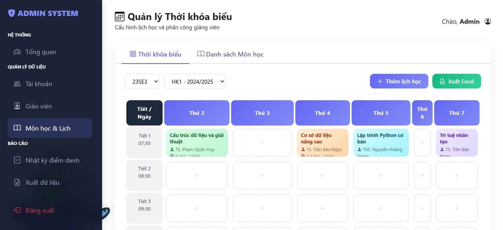
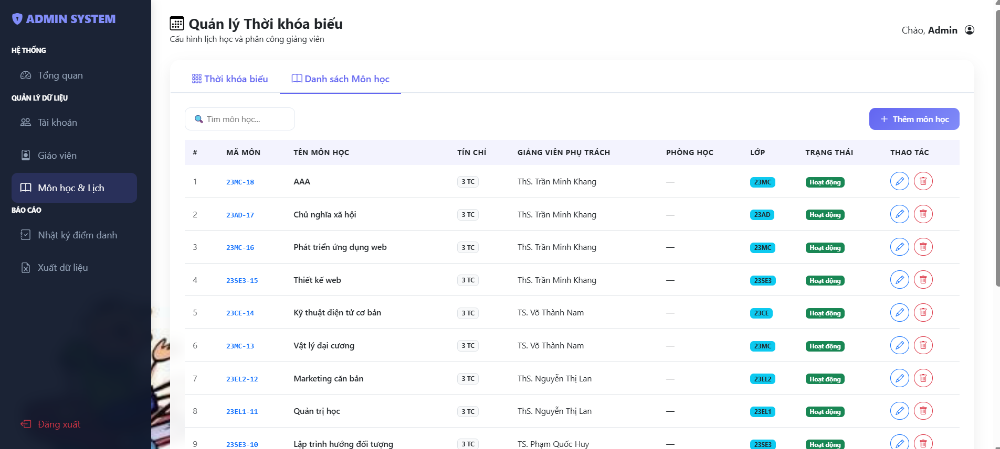
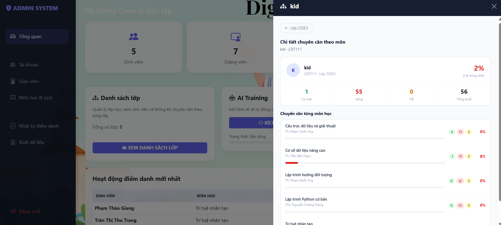
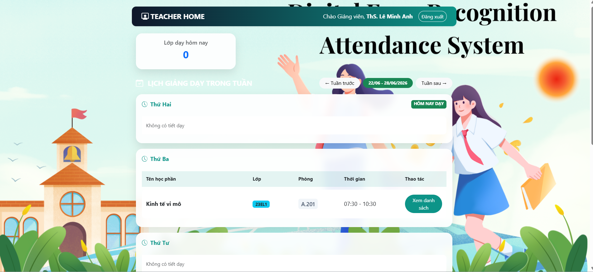
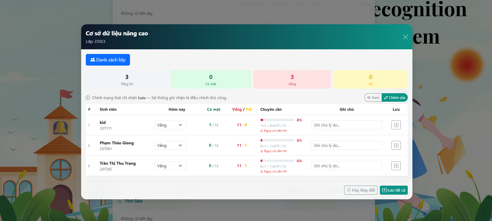
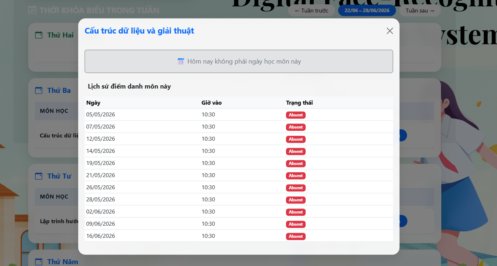
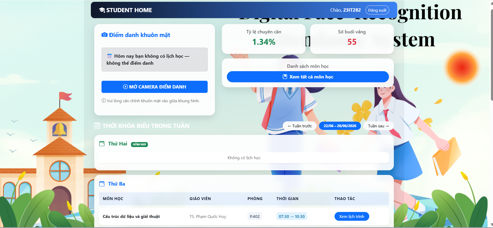
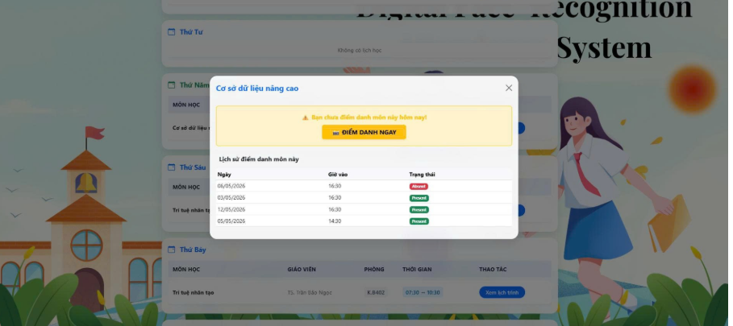
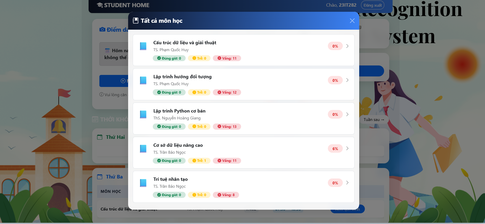

# 🎓 Digital Facial Recognition Attendance System

An intelligent web-based attendance management system that automatically records attendance using facial recognition technology.

The system was developed to replace traditional attendance methods such as paper registers and RFID cards with a faster, more accurate, and secure solution.

Teachers and administrators can manage students, subjects, and attendance records through an interactive dashboard while performing real-time face recognition.

---

## 📌 Features

### 👤 Facial Recognition Attendance

* Real-time face detection and recognition using a webcam.
* Automatically marks attendance when a registered user is identified.
* Prevents proxy attendance and reduces manual errors.

### 👨‍🎓 Student Management

* Add, update, and delete students.
* Register facial data for each student.
* Manage student information.

### 👨‍🏫 Teacher Management

* Add and manage teacher accounts.
* Control access permissions.

### 📚 Subject Management

* Create and manage subjects.
* Organize attendance by subject.

### 📊 Attendance Management

* Automatically save attendance records.
* View attendance history.
* Calculate attendance percentages and statistics.

### 📈 Dashboard & Analytics

* Interactive dashboard.
* Attendance statistics.
* Attendance trend visualization.

### 🔐 Security & Accuracy

* Uses facial embeddings for reliable recognition.
* Works under different lighting conditions.
* Reduces fraudulent attendance attempts.

---

# 🛠️ Technology Stack

| Category         | Technology                   |
| ---------------- | ---------------------------- |
| Backend          | Python, Flask                |
| Frontend         | HTML5, CSS3, JavaScript      |
| Computer Vision  | OpenCV                       |
| Face Recognition | face_recognition             |
| Machine Learning | K-Nearest Neighbors (KNN)    |
| Database         | MySQL                        |
| Deployment       | Local Network (Flask Server) |

---

# 📂 Project Structure

```text
Digital-Facial-Recognisation-Attendance-System/

├── dataset/
├── route/
├── static/
├── templates/
├── app.py
├── face_model.pkl
├── embeddings_cache.pkl
├── requirements.txt
├── README.md
└── .gitignore
```

---

# 📋 Prerequisites

Install the following software before running the project:

* Python 3.10+
* MySQL
* Google Chrome
* Webcam
* Git

---

# 🚀 Installation

## 1. Clone Repository

```bash
git clone https://github.com/thutrang1312/Digital-Facial-Recognisation-Attendance-System.git

cd Digital-Facial-Recognisation-Attendance-System
```

## 2. Create Virtual Environment

```bash
python -m venv .venv
```

## 3. Activate Virtual Environment

Windows

```bash
.venv\Scripts\activate
```

## 4. Install Required Packages

```bash
pip install -r requirements.txt
```

## 5. Configure MySQL Database

Update your MySQL connection information inside the project.

Example:

```python
host="localhost"
user="root"
password="your_password"
database="attendance_system"
```

## 6. Run Application

```bash
python app.py
```

Open browser:

```text
http://127.0.0.1:5000
```

---

# ⚠️ Camera Access Configuration

If the system is accessed through a local IP address (e.g. `http://172.xxx.xxx.xxx:5000`), Google Chrome may block webcam access because the connection is not secure.

To allow camera access:

1. Open Chrome.

2. Enter:

```text
chrome://flags/#unsafely-treat-insecure-origin-as-secure
```

3. In **Insecure origins treated as secure**, add your local address.

Example:

```text
http://172.26.19.66:5000
```

4. Restart Chrome.

---

# 📸 System Demo

## 👨‍🏫 Admin

<p align="center">
  
  
  
  
</p>
---

## 👨‍🏫 Teacher 

<p align="center">
  
  
  
</p>

## 👨‍🎓 Student 

<p align="center">
  
  
  
</p>

---

# 📍 Applications

* 🏫 Schools
* 🎓 Universities
* 🏢 Offices
* 📚 Training Centers

---

# 💡 Benefits

✅ Reduces manual work

✅ Saves time

✅ Improves attendance accuracy

✅ Prevents fraudulent attendance

✅ Provides real-time attendance monitoring

✅ Easy to manage and scale

---

# 👩‍💻 Author

**Trần Thị Thu Trang**

Vietnam - VKU (Vietnam-Korea University of Information and Communication Technology)
